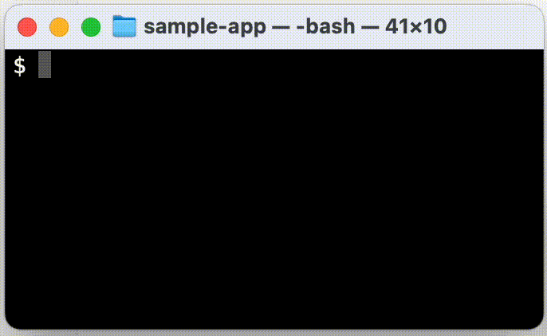

<div align="center">
	<br>
	<br>
	<br>
	
	<br>
	<br>
	<br>
</div>

# fastrun

Instead of typing...
```bash
npm run dev
```
Isn't it much faster to just type:
```bash
f [Enter]
```

<div align="center">
	<br>
	
	<br>
</div>


This command launcher tool makes it possible!

Even with multiple commands in your project, you can use incremental search to filter them or select with arrow keys - no need to remember the exact command names.

## Features

- Quick command selection with fuzzy search using fzf
- Support for npm scripts and make targets
- Project-specific and global configurations
- Extensible plugin system

## Installation


### Quick Install

```bash
brew install katoken03/fastrun/fastrun
```

### Prerequisites

- [Homebrew](https://brew.sh/) (for macOS users)


### Manual Installation

If you prefer to install from source:

1. Clone the repository
2. Build using Go 1.x
3. Install dependencies

## Usage

Basic command syntax:

```bash
f           # List and select available commands
f <pattern> # Filter commands by pattern
```

Examples:

```bash
f              # Shows all available commands
f test         # Shows commands containing "test"
f "run dev"    # Shows commands containing "run dev"
```

## Configuration

fastrun can be configured at two levels:

1. Global configuration: `~/.config/f/config.json`
2. Project configuration: `.f/config.json`

Example configuration:
```json
{
  "plugins": ["npm", "make"],
  "defaultTool": "npm"
}
```

## Shell History Integration

To add selected commands to your shell history, add the following function to your shell configuration file:

### For Bash (`.bash_profile` or `.bashrc`):

```bash
f() {
    local cmd=$(command f -t "$@")
    if [ $? -eq 0 ] && [ -n "$cmd" ]; then
        # Display command in cyan color (DisplayCommand equivalent)
        echo -e "\033[36m$cmd\033[0m"
        history -s "$cmd"
        eval "$cmd"
    fi
}
```

### For Zsh (`.zshrc`):

```zsh
f() {
    local cmd=$(command f -t "$@")
    if [ $? -eq 0 ] && [ -n "$cmd" ]; then
        # Display command in cyan color (DisplayCommand equivalent)
        echo -e "\033[36m$cmd\033[0m"
        print -s "$cmd"
        eval "$cmd"
    fi
}
```

Both functions will:
- Execute the selected command
- Add it to your shell history so you can access it with the up arrow key
- Handle flags normally by passing them directly to the fastrun binary

## Contributing

Contributions are welcome! Please feel free to submit a Pull Request. For major changes, please open an issue first to discuss what you would like to change.

## License

[MIT License](LICENSE)

This tool is designed to improve developer productivity by eliminating the need to type long commands repeatedly, allowing you to focus more on development.