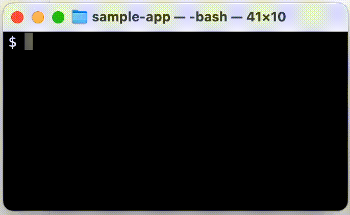

<div align="center">
	<br>
	<br>
	<br>
	
	<br>
	<br>
	<h3>The fastest way to run NPM scripts and Makefile targets</h3>
	<br>
</div>

## Install

```bash
brew install katoken03/fastrun/fastrun
```

## What is FastRun?

Instead of typing...

```bash
npm run dev
```

Just type:

```bash
f [Enter]
```

<div align="center">
	<br>
	
	<br>
	<br>
</div>

FastRun instantly shows all available commands in your project — npm scripts and Makefile targets — and lets you select one with fuzzy search or arrow keys. No need to remember command names.

## Features

- **Instant fuzzy search** — powered by [fzf](https://github.com/junegunn/fzf)
- **npm & Makefile support** — automatically detects scripts in your project
- **Smart package manager detection** — works with npm, pnpm, bun, and [ni](https://github.com/antfu/ni)
- **Shell history integration** — selected commands are added to your shell history

## Requirements

- [Homebrew](https://brew.sh/)
- [fzf](https://github.com/junegunn/fzf) — `brew install fzf`

## Usage

Run `f` in any project directory:

```bash
f
```

FastRun will list all available commands. Use fuzzy search to filter, arrow keys to navigate, and Enter to execute.

## Shell History Integration

To have selected commands saved to your shell history (accessible with the ↑ key), add the following snippet to your shell config.

### Bash (`.bash_profile` or `.bashrc`)

```bash
f() {
    if [[ "$1" == --* ]]; then
        command f "$@"
        return
    fi
    local cmd=$(command f -t "$@")
    if [ $? -eq 0 ] && [ -n "$cmd" ]; then
        echo -e "\033[36m$cmd\033[0m"
        history -s "$cmd"
        eval "$cmd"
    fi
}
```

### Zsh (`.zshrc`)

```zsh
f() {
    if [[ "$1" == --* ]]; then
        command f "$@"
        return
    fi
    local cmd=$(command f -t "$@")
    if [ $? -eq 0 ] && [ -n "$cmd" ]; then
        echo -e "\033[36m$cmd\033[0m"
        print -s "$cmd"
        eval "$cmd"
    fi
}
```

## Contributing

Contributions are welcome! Feel free to open an issue or submit a pull request.

## License

[MIT](LICENSE)
